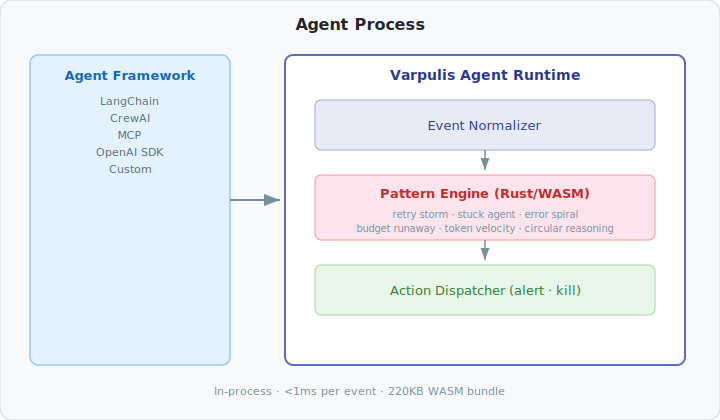

# Varpulis Agent Runtime

Real-time behavioral guardrails for AI agents.

Detect retry storms, circular reasoning, budget overruns, and failure spirals in your AI agents — as they happen, not after.

```bash
npm install @varpulis/agent-runtime
# or
pip install varpulis-agent-runtime
```

Works with **LangChain**, **MCP**, **OpenAI Agents SDK**, or any custom agent.
Runs in-process via WASM (JS) or native extension (Python) — zero infrastructure, sub-millisecond latency, 380KB bundle.

Powered by the **Varpulis CEP engine** — a production-grade Complex Event Processing engine with SASE+ pattern matching, Kleene closure, and Zero-suppressed Decision Diagrams (ZDD) for efficient combinatorial matching.

---

## Why

AI agents in production fail in ways that are invisible to existing tools:

| Failure Mode | What Happens | Why Current Tools Miss It |
|---|---|---|
| **Retry storms** | Agent calls the same tool with identical params over and over | Each individual call looks valid |
| **Circular reasoning** | Agent alternates between tools without progressing (A→B→A→B→...) | Each step appears purposeful in isolation |
| **Budget runaway** | Cumulative LLM token spend exceeds threshold | No per-call anomaly, only aggregate |
| **Error spirals** | Tool error → reformulate → tool error → reformulate → ... | Each retry is different enough to pass static checks |
| **Stuck agent** | 20 steps of "thinking" without producing an answer | No single step is wrong |
| **Token velocity spike** | Sudden 3x increase in tokens per step | Gradual degradation, no sharp boundary |

These are **temporal patterns** — they only become visible when you look at sequences of events over time. Observability tools (LangSmith, Braintrust) analyze traces post-hoc. Static guardrails (Guardrails AI, NeMo) validate individual inputs/outputs. Varpulis detects behavioral patterns as they unfold.

---

## Quick Start

### JavaScript / TypeScript

```typescript
import { WasmAgentRuntime } from '@varpulis/agent-runtime/wasm/varpulis_agent_wasm.js';
import { VarpulisAgentRuntime, Patterns } from '@varpulis/agent-runtime';

// Create runtime with all default patterns
const wasm = WasmAgentRuntime.withDefaultPatterns();
const runtime = new VarpulisAgentRuntime(wasm);

// Or pick specific patterns with custom thresholds
const wasm2 = new WasmAgentRuntime();
const runtime2 = new VarpulisAgentRuntime(wasm2, {
  patterns: [
    Patterns.retryStorm({ min_repetitions: 3, window_seconds: 10 }),
    Patterns.budgetRunaway({ max_cost_usd: 0.50 }),
    Patterns.stuckAgent({ max_steps_without_output: 10 }),
  ],
  cooldown_ms: 5000,
});

// Listen for detections
runtime.on('retry_storm', (detection) => {
  console.warn(`Retry storm: ${detection.message}`);
});

runtime.on('budget_runaway', (detection) => {
  if (detection.severity === 'error') {
    console.error('Budget exceeded — killing agent');
    // your kill logic here
  }
});

// Push events from your agent's execution loop
runtime.observe({
  timestamp: Date.now(),
  event_type: {
    type: 'ToolCall',
    name: 'search_api',
    params_hash: hashParams({ query: 'weather in paris' }),
    duration_ms: 200,
  },
});
```

### Python

```python
from varpulis_agent_runtime import VarpulisAgentRuntime, Patterns

runtime = VarpulisAgentRuntime(
    patterns=[
        Patterns.retry_storm(min_repetitions=3, window_seconds=10),
        Patterns.budget_runaway(max_cost_usd=0.50),
        Patterns.stuck_agent(max_steps_without_output=10),
    ],
    cooldown_ms=5000,
)

@runtime.on("retry_storm")
def handle_retry_storm(detection):
    print(f"Retry storm: {detection['message']}")

# Push events
detections = runtime.observe(
    event_type={"type": "ToolCall", "name": "search", "params_hash": 42, "duration_ms": 200}
)
```

---

## Patterns

Six pre-packaged patterns ship out of the box. All are configurable and have sensible defaults.

### Retry Storm

Same tool called N+ times with identical parameters within a time window.

```typescript
Patterns.retryStorm({
  min_repetitions: 3,   // default
  window_seconds: 10,   // default
})
```

**Detects:** Agent blindly retrying a failing API call, LLM regenerating the same tool call.

### Stuck Agent

Agent executes too many steps or spends too long without producing output.

```typescript
Patterns.stuckAgent({
  max_steps_without_output: 15,           // default
  max_time_without_output_seconds: 120,   // default
})
```

**Detects:** Agent stuck in a reasoning loop, infinite planning without action.

### Error Spiral

Repeated tool failures within a time window, regardless of which tool fails.

```typescript
Patterns.errorSpiral({
  min_error_count: 3,   // default
  window_seconds: 30,   // default
})
```

**Detects:** API outage causing cascade of failures, permission issues, network problems.

### Budget Runaway

Cumulative LLM cost or token usage exceeds thresholds. Fires a **warning at 80%** and an **error at 100%**.

```typescript
Patterns.budgetRunaway({
  max_cost_usd: 1.00,      // default
  max_tokens: 100_000,     // default
  window_seconds: 60,      // default
})
```

**Detects:** Agent burning through API credits, runaway token consumption.

### Token Velocity Spike

Sudden increase in token consumption rate per step compared to a rolling baseline.

```typescript
Patterns.tokenVelocity({
  baseline_window_steps: 5,   // default
  spike_multiplier: 2.0,      // default
})
```

**Detects:** Agent losing efficiency, generating increasingly verbose prompts.

### Circular Reasoning

Repeating cycle in tool call sequences (e.g., search→read→search→read→...).

```typescript
Patterns.circularReasoning({
  max_cycle_length: 4,         // default
  min_cycle_repetitions: 2,    // default
})
```

**Detects:** Agent stuck alternating between tools without making progress.

---

## Framework Integrations

### LangChain (JS/TS)

```typescript
import { VarpulisLangChainHandler } from '@varpulis/agent-runtime';

const handler = new VarpulisLangChainHandler(runtime);

// Pass as a callback to any LangChain agent/chain
const result = await agent.invoke(
  { input: "What's the weather?" },
  { callbacks: [handler] }
);
```

### LangChain (Python)

```python
from varpulis_agent_runtime.integrations.langchain import VarpulisCallbackHandler

handler = VarpulisCallbackHandler(runtime)
result = agent.invoke({"input": "What's the weather?"}, config={"callbacks": [handler]})
```

### MCP (Model Context Protocol)

```typescript
import { McpAdapter } from '@varpulis/agent-runtime';

const adapter = new McpAdapter(runtime);

// In your MCP message handler:
server.on('tool_use', (msg) => {
  const detections = adapter.processToolUse({
    name: msg.name,
    arguments: msg.arguments,
  });
  // Handle detections...
});

server.on('tool_result', (msg) => {
  adapter.processToolResult({
    name: msg.name,
    content: msg.content,
    is_error: msg.is_error,
  });
});
```

### OpenAI Agents SDK

```typescript
import { createVarpulisOpenAIHooks } from '@varpulis/agent-runtime';

const hooks = createVarpulisOpenAIHooks(runtime);

// Wire into your agent's event loop
hooks.onToolStart('search_api', { query: 'weather' });
hooks.onToolEnd('search_api', 'sunny, 22°C');
hooks.onStepStart(1);
hooks.onStepEnd(1, true);
hooks.onLlmUsage(500, 200, 'gpt-4');
```

### Any Custom Agent

Use the raw `observe()` API to push events from any agent framework:

```typescript
runtime.observe({
  timestamp: Date.now(),
  event_type: { type: 'ToolCall', name: 'search', params_hash: 42, duration_ms: 200 },
});

runtime.observe({
  timestamp: Date.now(),
  event_type: { type: 'ToolResult', name: 'search', success: true },
});

runtime.observe({
  timestamp: Date.now(),
  event_type: { type: 'LlmCall', model: 'claude-sonnet-4-20250514', input_tokens: 500, output_tokens: 200, cost_usd: 0.003 },
});
```

---

## Event Types

Every agent action maps to one of these event types:

| Event Type | Fields | When to Emit |
|---|---|---|
| `ToolCall` | `name`, `params_hash`, `duration_ms` | Before/during a tool invocation |
| `ToolResult` | `name`, `success`, `error?` | After a tool returns |
| `LlmCall` | `model`, `input_tokens`, `output_tokens`, `cost_usd` | After an LLM call completes |
| `LlmResponse` | `model`, `has_tool_use` | After parsing the LLM response |
| `StepStart` | `step_number` | At the beginning of an agent step |
| `StepEnd` | `step_number`, `produced_output` | At the end of an agent step |
| `FinalAnswer` | `content_length` | When the agent produces a final output |

---

## Architecture

<p align="center">
  
</p>

The runtime is powered by the **Varpulis CEP engine** — a SASE+ (Stream-based And Shared Event processing) pattern matching engine compiled to WASM (JavaScript) or native extension via PyO3 (Python).

Each behavioral pattern is expressed as a SASE+ query with **Kleene closure** (one-or-more repetition), **cross-event predicates** (e.g., "same tool name as the first call"), and **temporal windows**. The engine uses an NFA-based matcher with **Zero-suppressed Decision Diagrams (ZDD)** to efficiently handle combinatorial explosion in unbounded repetition matching — 20 events in a Kleene closure produce ~1M combinations represented in ~100 ZDD nodes, not 1M explicit states.

Pattern detection runs in-process with sub-millisecond latency per event. 380KB WASM bundle.

### SASE Patterns Under the Hood

Each pre-packaged pattern maps to a SASE+ expression:

| Pattern | SASE+ Expression |
|---|---|
| **Retry Storm** | `SEQ(ToolCall AS first, ToolCall+ WHERE name = first.name AND params_hash = first.params_hash) WITHIN 10s` |
| **Error Spiral** | `ToolResult{success = false}+ WITHIN 30s` |
| **Budget Runaway** | `LlmCall+ WITHIN 60s` with post-match aggregation on `cost_usd` and tokens |
| **Stuck Agent** | `StepEnd{produced_output = false}+ WITHIN 120s` with `NOT FinalAnswer` negation |
| **Circular Reasoning** | `SEQ(ToolCall AS a, ToolCall{name != a.name} AS b, ToolCall{name = a.name}, ToolCall{name = b.name})` |
| **Token Velocity** | Stateful step-tracking with moving average baseline |

The `+` operator is **Kleene closure** — it matches one or more repetitions of the inner pattern. The ZDD data structure compactly represents all valid event combinations without exponential blowup.

---

## API Reference

### `VarpulisAgentRuntime`

| Method | Description |
|---|---|
| `observe(event)` | Push an event, returns detections |
| `on(patternName, callback)` | Listen for a specific pattern |
| `onDetection(callback)` | Listen for all detections |
| `reset()` | Clear all detector state |
| `eventCount` | Number of events processed |

### `Detection`

```typescript
{
  pattern_name: string;       // e.g. "retry_storm"
  severity: "info" | "warning" | "error" | "critical";
  message: string;            // Human-readable description
  details: Record<string, unknown>;  // Pattern-specific data
  timestamp: number;          // When the detection fired
}
```

---

## License

Apache-2.0
